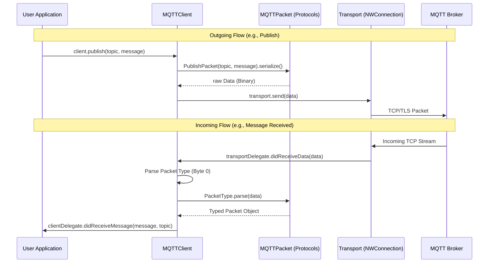

# MQTT Framework Architectural Flow

This document explains the data flow and internal driving logic of the `MQTTFramework`.

## Overall Flow Diagram

The following diagram shows how a message flows from the User's code through the framework to the network, and back.

## 1. Outgoing Request Lifecycle (`Client -> Broker`)

When you call a method like `publish(topic: "sensor/temp", message: data)`:

1.  **Entry Point**: The request enters via the public `MQTTClient` API.
2.  **Serialization**: The client creates a concrete `PublishPacket` struct. This struct's `serialize()` method is called to transform the parameters into a `Data` object following the MQTT 3.1.1 spec.
3.  **Transport Delivery**: The client hands the binary `Data` to the `Transport` layer.
4.  **Network Push**: The `Transport` layer uses `NWConnection.send` to push the bytes into the TCP/TLS socket.

## 2. Incoming Data Evaluation (`Broker -> Client`)

When the broker sends data (like a `CONNACK` or a `PUBLISH` message):

1.  **Network Capture**: The `Transport` layer's `receive()` loop captures the incoming stream from `NWConnection`.
2.  **Delegate Notification**: The `Transport` notifies `MQTTClient` (its delegate) that raw bytes arrived.
3.  **Packet Identification**: The `MQTTClient` looks at the first byte of the data to determine the `MQTTPacketType`.
4.  **Parsing/Decapsulation**:
    -   If it's a `CONNACK`, it uses `ConnAckPacket.parse()` to extract the success/failure code.
    -   If it's a `PUBLISH`, the client extracts the topic length, the topic string, and finally the message payload.
5.  **State Logic**: The client may update its internal state (e.g., moving from `.connecting` to `.connected` after a successful `CONNACK`).
6.  **User Callback**: Finally, the client notifies the `User Application` via the `MQTTClientDelegate`.

## 3. Practical Example: The Connection Handshake

1.  **User**: Calls `client.connect()`.
2.  **Framework**: `Transport` starts `NWConnection`.
3.  **Framework**: Once `NWConnection` is `.ready`, the client automatically sends a `ConnectPacket`.
4.  **Network**: `CONNECT` bytes sent to broker.
5.  **Broker**: Responds with `20 02 00 00` (CONNACK success).
6.  **Framework**: `Transport` receives 4 bytes.
7.  **Framework**: `MQTTClient` sees `0x20` (first nibble `2`), identifies it's a `CONNACK`.
8.  **Framework**: `ConnAckPacket.parse()` evaluates the bytes.
9.  **Framework**: `MQTTClient` sets `state = .connected`.
10. **User**: Receives `didChangeState(.connected)` in their delegate.
